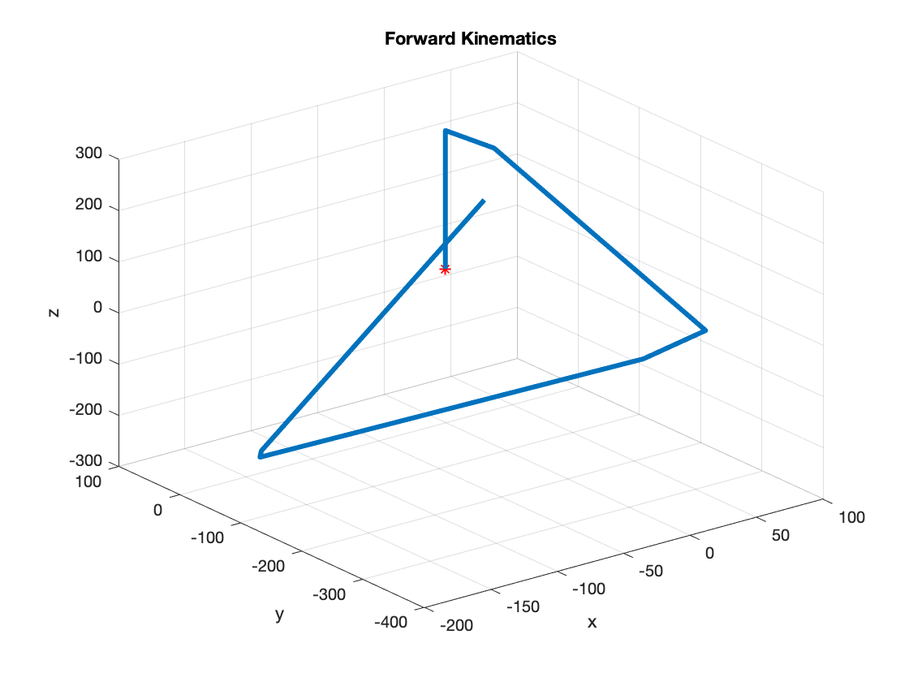
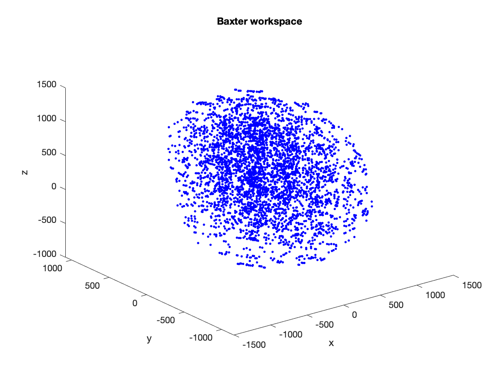
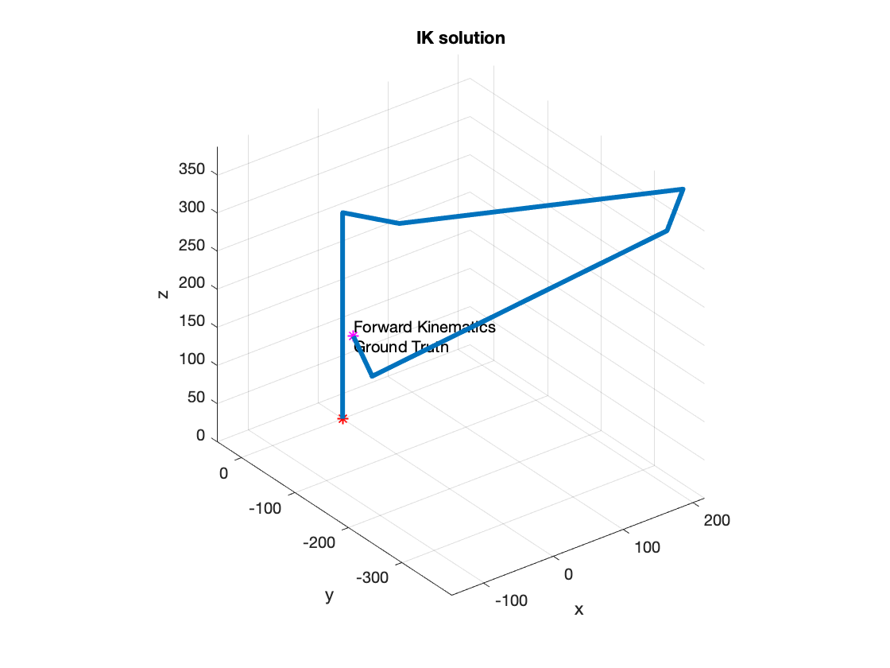
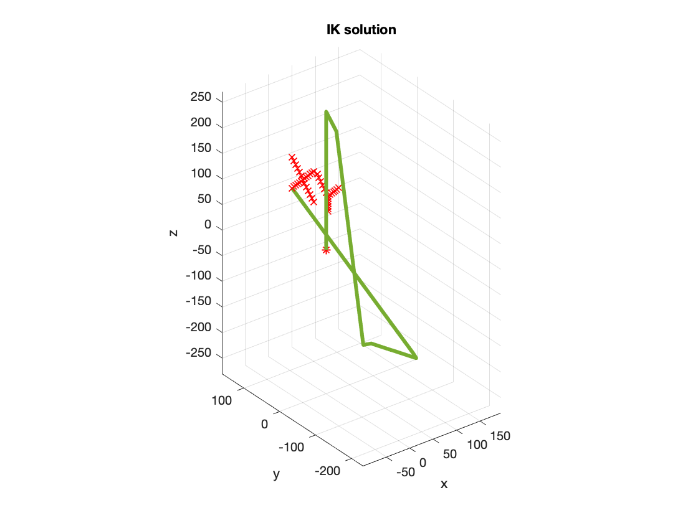

# ELEC4010M/MECH4000J Project1

This individual project is based on Baxter 7-DOF dual-arm robot configurations. Functions implemented are listed below,

- Baxter Forward Kinematics
- Baxter Worksapce
- Baxter Inverse Kinematics
- Application of Inverse Kinematics

More information could be referred to the project description.

## Run the code

In order to run the code, please refer to the sample usage in main.m. Simply **comment  the irrelevant sections** and run each task **individually**. Otherwise, the last task will overlap on pervious ones, resulting an incomplete plot of initials. 

To run task1: **forward kinematics**, please follow the command. Please provide seven valid angles seperately otherwise the function will return an error message. 

```matlab
clc, close all;
figure;
[pos,joint_plot] = fk(-85.9068,34.5294,-24.9013,105.4860,25.2009, 118.3710,0,true); %function [pos,joint_plot] = fk(theta1,theta2,theta3,theta4,theta5,theta6,theta7,plot)

```

To run task2: **workspace generation**, please follow the command. If you want to increase the density of the point cloud, simply increase *num*. If you want to visualize the workspace, set *plot* to true.

```matlab
clc, close all;
figure;
[x,y,z] = ws(4,true); %function [x,y,z] = ws(num,plot)
```

To run task3: **inverse kinematics**, please follow the command. Multiple feasible solutions will return to the console and be visualized seperately. If you want to visualize the robot arm position computed from forward kinematics, please set *ik_solver* to true. If you only need one solution, set *ik_solver* to false to fasten the program execution. **Note** that wrist roll 2 could be any values within the limit of its configuration as it is redundant. 

```matlab
clc, close all;
[sol,final,joint_plot]=ik([50,45,70],true); %function [sol,final,joint_plot]=ik(pos,iksolver)
```

To run task4: **application of inverse kinematics**, please follow the command. Initials of my name YX, together with positions of the robot arm, will be displayed step by step as waypoints of the end-effector are generated. 

```matlab
clc, close all;
figure;
write(); %function []=write()
```

## Expected results 

|  |        |
| ------------------------- | ------------------------------- |
|  |  |

## Author

**Xinjie Yao** [xyaoab](https://github.com/xyaoab)

## Acknowledgment 

Prof. Jun Seo, Instructor of 2019 Spring ELEC4010M/MECH4000J [Robotic Manipulation and Mobility](https://canvas.ust.hk/courses/22842), HKUST, HK

